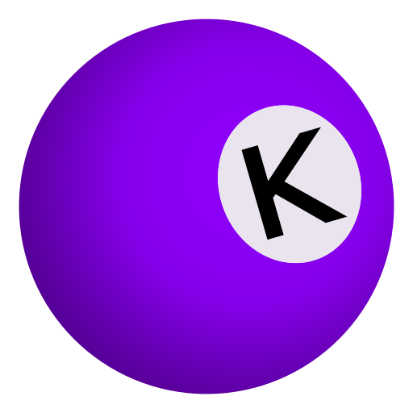

    

<h1 align="center">Ludika</h1>
<h3 align="center">A Platform for Game-Based Learning Tools Assessment</h3>

    
    
    
    
    

This monorepo structure contains the entire stack of the Ludika Content Management System:

- [Frontend](./ludika-frontend): Nuxt
- [Backend](./ludika-backend): FastAPI, SQLModel, LangChain
- [Database](./ludika-db): PostgreSQL
- [Documentation](./ludika-docs): LaTeX
  - [APIssima Tool](./ludika-docs/tools/apissima.py): Python script to generate LaTeX API documentation from OpenAPI specs
- [Deployment](./ludika-deployment): Docker, Docker-Compose, NGINX
- [Graphics](./ludika-graphics/Ludika.afdesign): Ludika logo (Affinity Designer project)